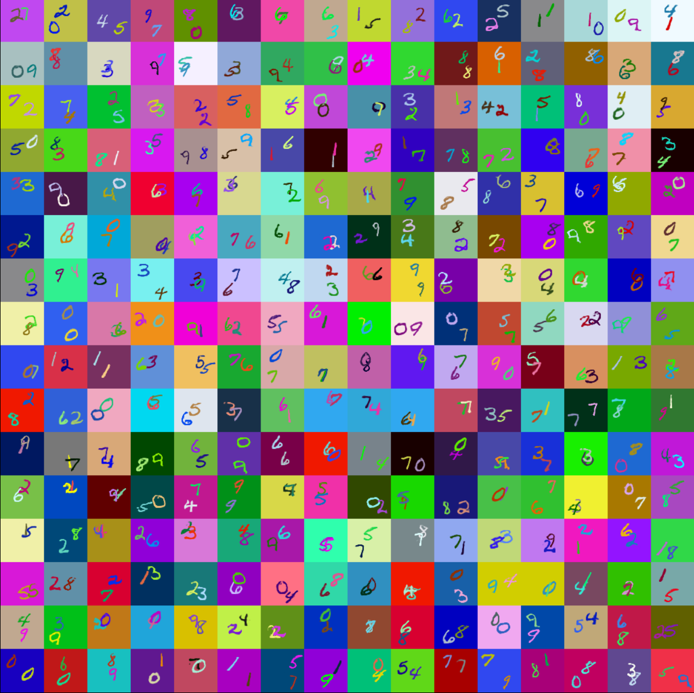

# MNISTDDRGB_ObjectDetection

## Table of Contents
- [Introduction](#introduction)
- [Dataset](#Dataset)
- [Results](#Results)
- [MNISTDDRGBDatasetIllustration](#MNISTDD-RGB Dataset Illustration)
- [References](#References)
- [Contact](#contact)

## Introduction
This project focuses on object detection using the MNIST Double Digits RGB dataset. The goal is to detect and classify two digits in RGB images and predict their bounding boxes. The project combines the power of DarkNet53 for object detection and UNet for Image Segmentation, achieving remarkable classification, IOU and Segmentation scores.

## Dataset
The dataset consists of:
- 3 subsets: train, validation and test containing 55K, 5K and 10K samples respectively
- Input: A numpy array of flattened 64x64x3 images, shape: (number of samples, 12288).
    - Labels: A 2-dimensional vector that has two numbers in the range [0, 9] which are the two digits in the image.
    - Segmentation Mask: A 64×64 image with pixel values in the range [0, 10], where 10 represents the background.
- Output:
  - Classes: A numpy array of classes in the corresponding image, shape: (number of samples, 2).
  - Prediction Boxes: A numpy array of bounding boxes in the corresponding image, shape: (number of samples, 2, 4).
  
## Results

- Classification Accuracy: 98.050 %
- Detection IOU: 92.538 %
- Segmentation Accuracy: 99.669 %
- Test time: 74.939 seconds
- Test speed: 66.721 images / second
- Classification Score: 100.000
- IOU Score: 80.494
- Segmentation Score: 100.000
- Overall Score: 95.124

## MNISTDD-RGB Dataset Illustration

Here is an example image from the MNISTDD-RGB dataset to give you an idea of what the dataset looks like:

## References
-  UNet Model : https://github.com/milesial/Pytorch-UNet/tree/master

## Contact
- If you need weights file please mail me : babariyayash9200@gmail.com

